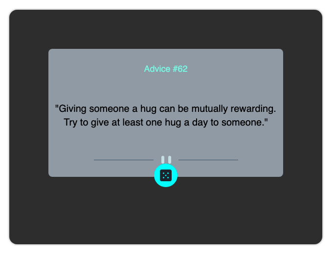

# Frontend Mentor - Advice generator app solution

This is a solution to the [Advice generator app challenge on Frontend Mentor](https://www.frontendmentor.io/challenges/advice-generator-app-QdUG-13db). Frontend Mentor challenges help improve coding skills by building realistic projects.

## Table of contents

- [Overview](#overview)
  - [The challenge](#the-challenge)
  - [Screenshot](#screenshot)
  - [Links](#links)
- [My process](#my-process)
  - [Built with](#built-with)
  - [What I learned](#what-i-learned)
  - [Continued development](#continued-development)
  - [Useful resources](#useful-resources)
- [Author](#author)
- [Acknowledgments](#acknowledgments)

## Overview

### The challenge

Users should be able to:

- View the optimal layout for the app depending on their device's screen size
- See hover states for all interactive elements on the page
- Generate a new piece of advice by clicking the dice icon

### Screenshot

### Links

- Solution URL: [https://github.com/srikantgudi/advice-generator](https://github.com/srikantgudi/advice-generator)
- Live Site URL: [https://advice-generator-ecru-nine.vercel.app](https://advice-generator-ecru-nine.vercel.app)

## My process

### Built with

- SvelteKit
- Tailwindcss

### What I learned

- Using CSS and fetching random data from api.

### Continued development

- Would focus on using Sveltekit and Tailwindcss

### Useful resources

- [SvelteKit](https://kit.svelte.dev) - This is an amazing framework to build awesome web applications.
- [Tailwind CSS](https://tailwindcss.com/docs/) - This is an amazing CSS library. I'd recommend it to anyone still learning this concept.

## Author

- Website - [Srikant Gudi](https://github.com/srikantgudi/)
- Frontend Mentor - [@srikantgudi](https://www.frontendmentor.io/profile/srikantgudi)
